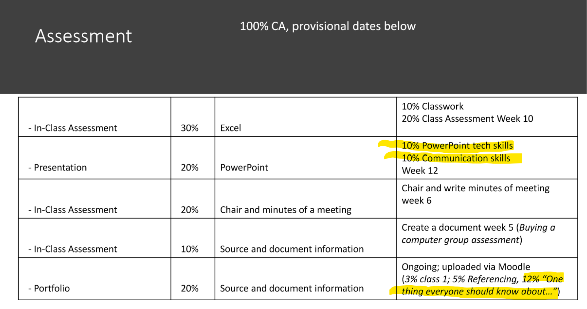

# CA

CA Requirements

This report will cover CA based on the following three areas:

- MS Word Processing (12%)
- MS PowerPoint presentation (10%)
- Communication Skills (10%)

*BSc in Forestry:*

This presentation will be completed alongside your **Dendrology** module
- Tom will also be attending the presentations at the end of the Semester and grading your communications side of this piece of CA.

Please feel free to [email me, Caroline Cahill](mailto:caroline.cahill@setu.ie) if you've any queries or concerns

Best of luck with your research!

Caroline Cahill