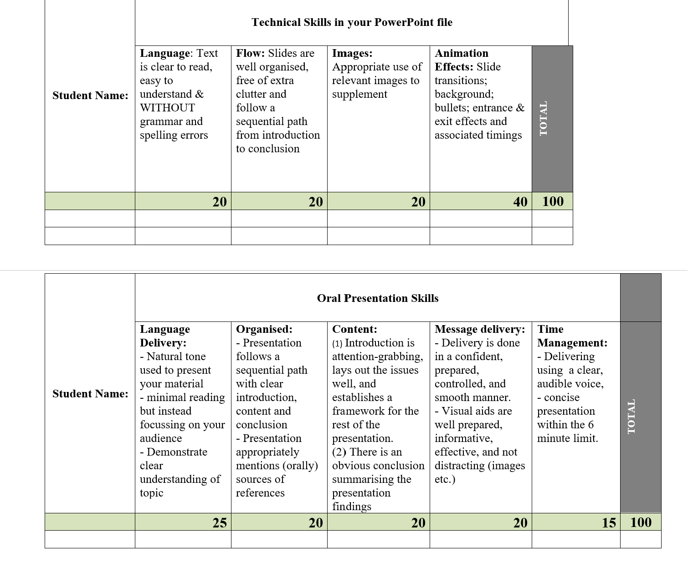

# Grading

Rubric · Check you've everything included

Below is an image of the grading rubric that will be used to grade your presentations:

You will see that there are two sections

1. Your ability to use MS PowerPoint software and
2. Your ability to communicate effectively