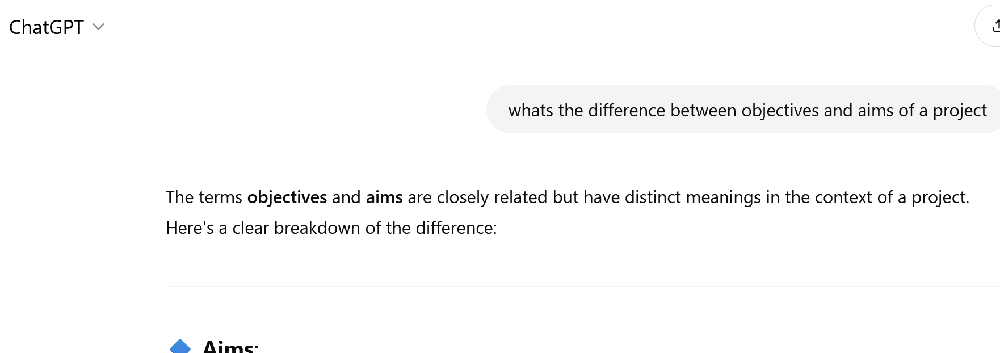
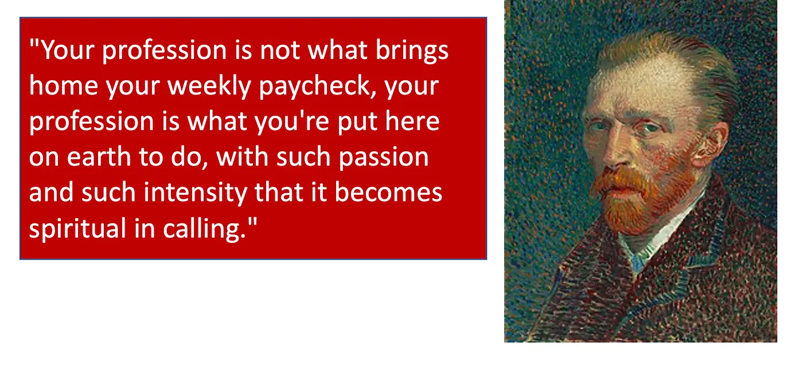
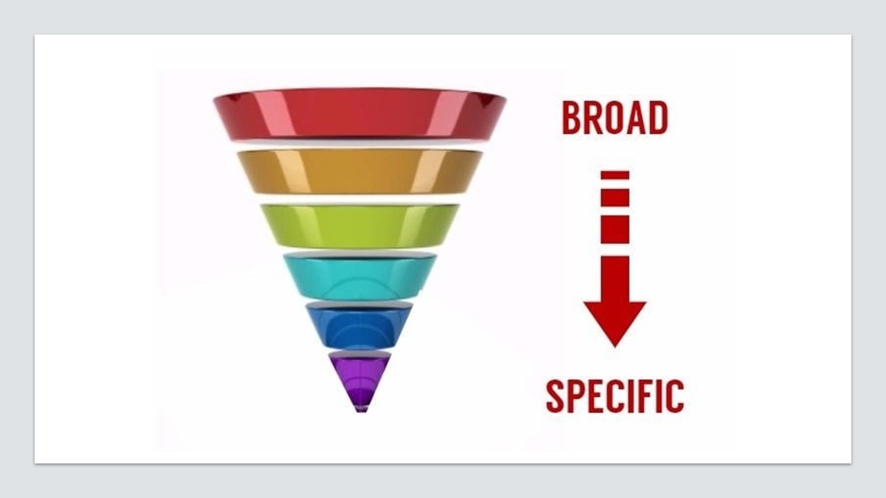
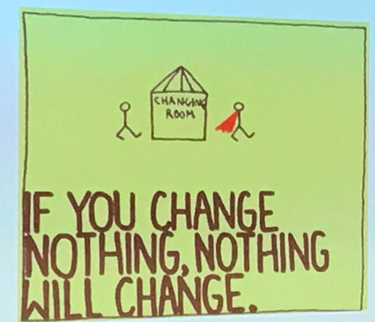

# Layout

Approach to Research

# Overall Research Layout

**Introduction:**

- States the aims of your research and your objectives

## TIP: use resources available to develop a deeper understanding of terms:

For example: 

You should define background of research, from broadly describing your research area and then detailing what **one** specific area you choose to research  

## TIP: don't forget the name of this report i.e. "Whats **one** thing everyong should know about..."

**Body:**

- Addresses audience at an appropriate level (rigorous, but generally understandable to a like-minded group such as your classmates).
- Ensure the talk is logical, following from one point to the next sequentially.

**Conclusion:**

Consider, have you achieved your aims and objectives as detailed in your introduction?
- Think about structuring this conclusion like a **past, present and future** of your research topic
- Don't forget to summarise major points of interest you found out from your research.
- Provides audience with a “take-home” message.

