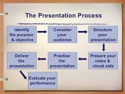
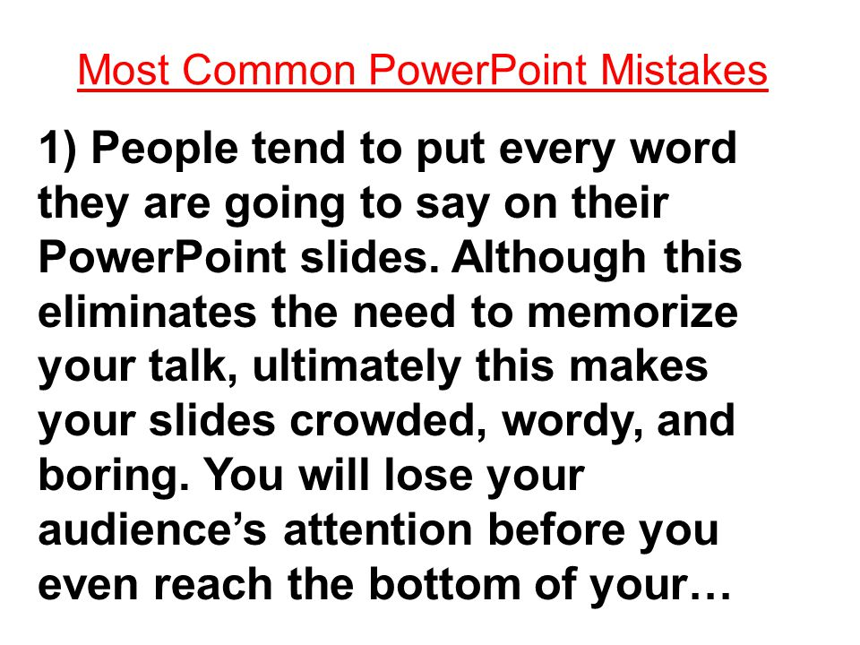
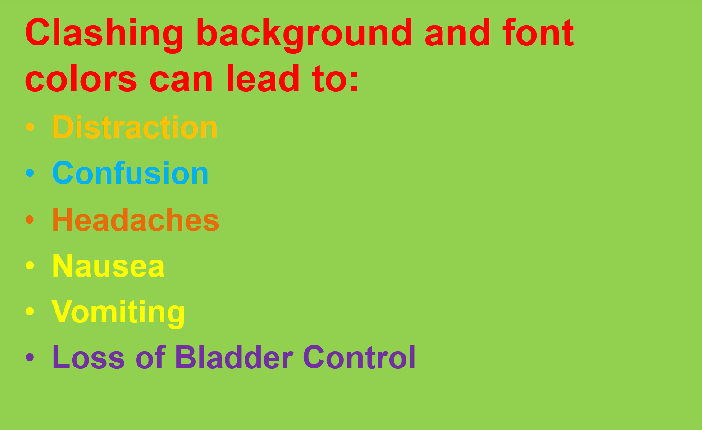
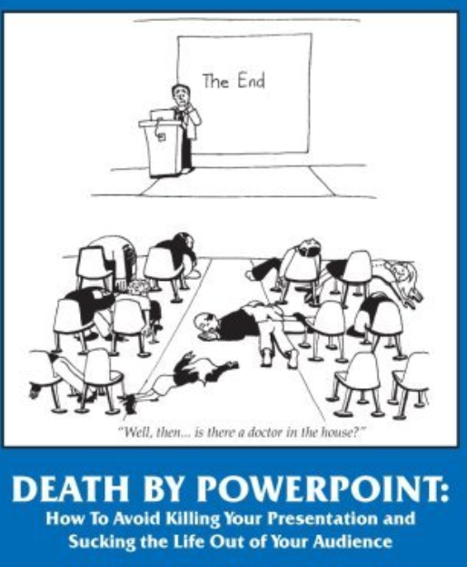

# Presenting

Approach to Presenting

# Overall Presentation Layout

# ORAL PRESENTATION 

Speaking Style/Delivery

- Speak clearly and at an understandable pace.
- Maintain eye contact.
- Well rehearse this for timing and preparation to better your confidence.
- Use body language appropriately.
- Stay within time limits.
- Be able to answer questions 
– Have prepared what to say if you don’t know the answer to a question?

# MICROSOFT POWERPOINT

1. Rely on images and NOT text

- Images/Graphs/figures are to be clear and understandable.
- text is to be readable and clear.
- know the source of your info/date/graphs/maps/charts etc.

2. MAXIMISE images with MINIMAL text:

3. Stick to MS PowerPoint defaults

IN SUMMARY: Stick to the above to avoid Death by Powerpoint

