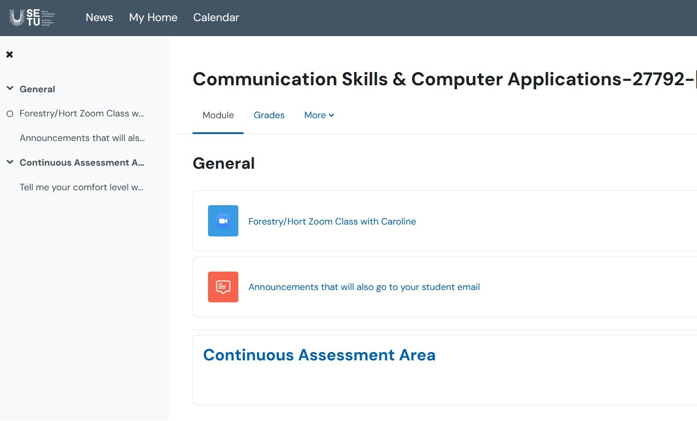

# Class Content

Supports · Tabs · Headings · TOC · 3% CA

## Where can I find my class content?

+ Class notes and assessment details:

You are now on your [https://computingclass.netlify.app](https://computingclass.netlify.app) webpage that will be your base site for contents for my class

 

You will need to set up a netlify account 

+ [Moodle](https://moodle.wit.ie/course/view.php?id=200054) 

This contains your

1. Zoom link and
2. Continuous Assessment upload areas 

 

+ If you would like to know more about how Assistive Technologies can support your learning, the [AT Hive](https://www.ahead.ie/Discover-your-AT) from AHEAD.ie will answer all of your questions and suggest technologies to match your needs. If you have any questions please [contact the Moodle support desk](mailto:moodle.wd@setu.ie)

+ Here, you can read further useful information into [Buying a computer/laptop](http://roboconnor.ie/tips-on-buying-a-laptop-for-college/) written by another SETU Waterford computing lecturer.

+ Please feel free to [email me](mailto:caroline.cahill@setu.ie) if you've **ANY** queries or concerns now or during the Semester

Best of luck with the Semester!

Caroline Cahill