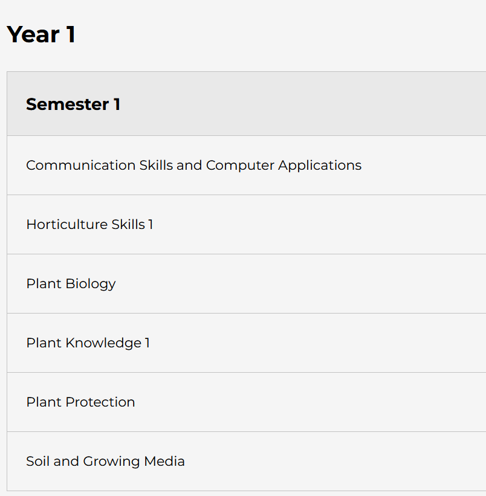

# Create OneDrive Folders

- Log onto OneDrive 

- Create one new folder called **ComputingClass**

- Now, create five more folder, one to store content from each for your modules

# BSc in Horticulture modules list

# BSc in Forestry modules list

At this stage, you will have created a total of SIX folders on OneDrive... USE THEM to store content from your modules 

