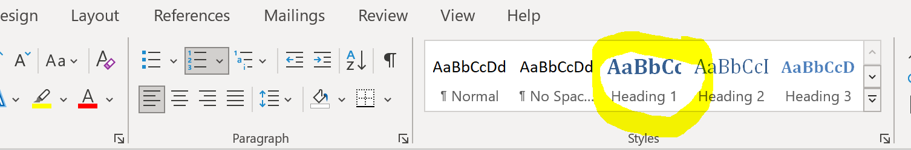
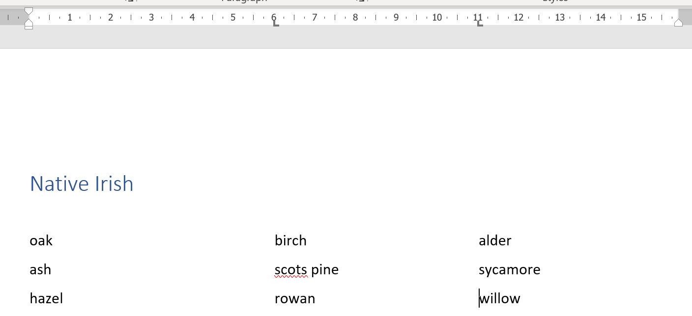
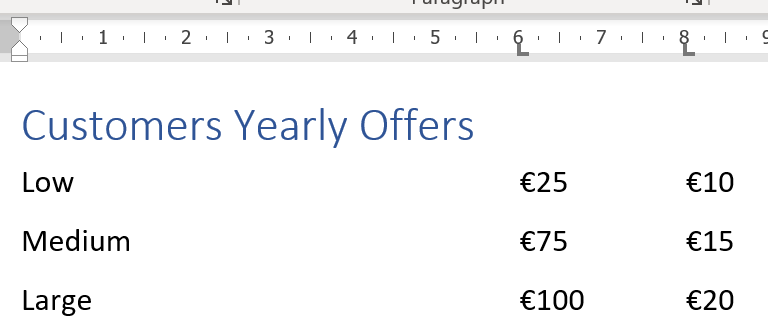
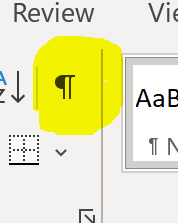
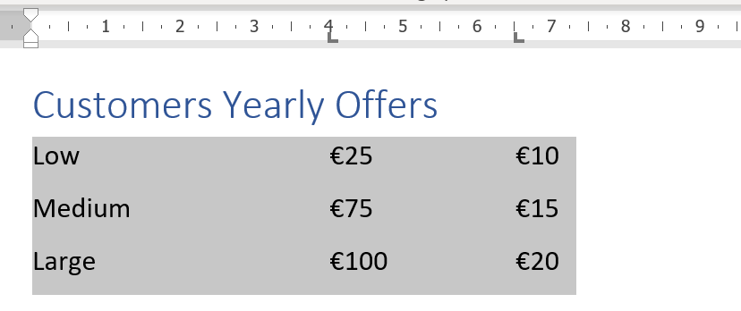

# Tabs and Heading Styles

tabs · heading styles 

Create a formatted MS Word document

## Heading Styles 

+ Create a new document and save as **TabsExercise** in your  **ComputingClass** folder 
+ Add Heading 1 styled text **Native Irish** to the top of the page

## Tabs 

+ Create tabs at **6cm** and **11cm** 
    - you can simply click on the **Ruler** along the top
    - if the ruler isn't there, click **View** and turn it on to visible

Type in the following tabbed content into your document, using the **Tab** key on your keyboard (above **CAPS**) to move between tabs:

## Page Breaks

+ Move your cursor to the next page using a **PAGE BREAK**

~~~
ctrl + Enter to move to the next page
~~~

+ Add Heading 1 styled text **Customers Yearly Offers** at the top of the new page 2

## View your Formatting 

View your tabs... switch this **Show/Hide** button on/off to view your formatting:

## Edit your tabs

Select this tabbed text and using the Ruler
+ move the tab currently at **6cm** back to **4cm**
+ move the tab currently at **8cm** back to **6.5cm**

It will look similar to:

+ Close your document
+ Exit MS Word
+ Back in OneDrive, rename this file to **Tabs_TOC**

*HOW TO RENAME IN ONEDRIVE:*
    - login to OneDrive (you **must** have closed your file in MS Word to rename... why?)
    - find the file and click on the three dots to the side
    - Rename as you wish
