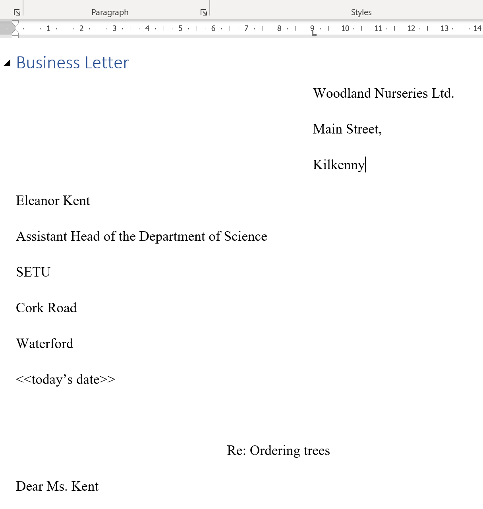

# Table Of Contents and 3% CA

By the end of this lab you will have added an Automated Table of Contents (TOC) to your final professional looking Word processed document.

Reopen your **Tabs_TOC** document 

Recreate the following letter on a new page within the **Tabs_TOC** document that **Woodland Nurseries Ltd** are sending to **Eleanor Kent** in **SETU**

## Taking note of:
+ the “**Business Letter**” text on top is formatted as Heading 1 styled text
+ the tabs for the senders address (on the right)
+ left align the receivers address (on the left)
+ use the **Insert/Date & Time** button to replace **<<today's date>>**
+ centre aligning "**Re: Ordering trees**"
+ 1.5 line spacing throughout

 

Now, return to the very beginning of the entire document 
~~~
ctrl+HOME
~~~

Create another new first page
~~~
ctrl+ENTER
~~~

# Create an Automated Table of Contents (TOC)

Into this new page, we will insert an automated Table of Contents
+ After you have created a document by using heading styles, you are ready to build an **automated table of contents**.

1.	Click where you want to insert the TOC (usually at the beginning of a document). 
2.	On the **References** tab, in the **Table of Contents** group, click **Table of Contents**, and then click the table of contents style that you want (usually the first one)

# Add a Cover Page

**Insert** a **Cover Page** template of your choice. Include:

+ your name
+ your course
+ your lecturers name

Now your TOC is showing the incorrect page numbers because you've a new page 1.

# Update an Automated Table of Contents

If you added or removed headings or other table of contents entries in your document, you can quickly update the table of contents.

1.	On the **References** tab, in the **Table of Contents** group, click **Update Table**. 
2.	Click Update page numbers only or **Update entire table**

Finally, 

+ Go to the end of your document
+ Insert a Page Break
+ Add a new **Heading 1** formatted title with the word **Shortcuts**
+ Copy the text below into this new page, filling in the blanks

**Shortcuts:**

+ Go get to the very top of any document:

click Ctrl + _____________
+ Go get to the very end of any document:

click Ctrl + _____________
+ To insert a new page:

click Ctrl + _______________

The ________ deletes to the left of the cursor
The ________ deletes to the right of the cursor

# UPLOAD YOUR COMPLETED WORK

Upload your completed formatted **Tabs_TOC** document to [Moodle Continuous Assessment Upload Area](https://moodle.wit.ie/mod/assign/view.php?id=4334408) (before the cut off of 9pm next Monday night)
