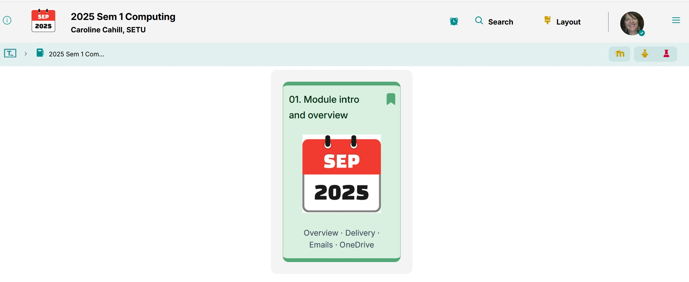
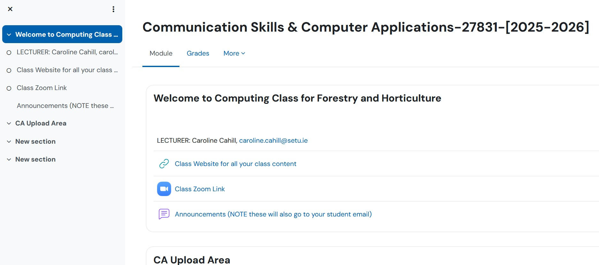

# Class Content

Emails · MS Office · OneDrive

Feel free to download the [Communications Skills and Computer Applications module descriptor](./archives/archive.zip) if you've not already received it during your Induction day.

## 1. Class content

You are now on your [computingclass.netlify.app](https://computingclass.netlify.app) webpage

This will be your base website for all class contents:

 

- Using your phone's *notes* section or similar, jot down your login details for tutors (GitHub)

## 2. Class Completed Work Upload Area

[Moodle](https://moodle.setu.ie/course/section.php?id=7440922) will contain your **Continuous Assessment** upload areas 

