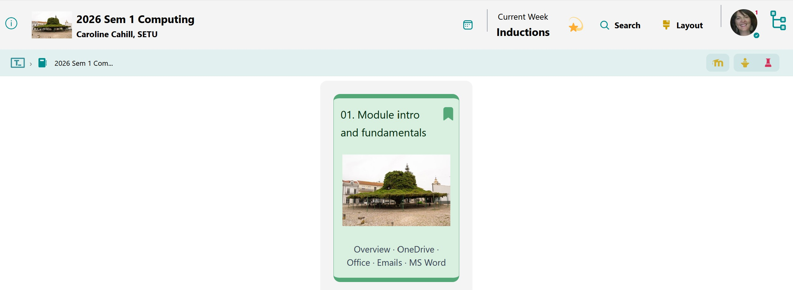

# Class Content

Emails · MS Office · OneDrive

Feel free to download the [Communications Skills and Computer Applications module descriptor](./archives/archive.zip) if you've not already received it during your Induction day.

## 1. Website for Class content

You are now on your [computingclass.netlify.app](https://computingclass.netlify.app) webpage

- your website for all **class content**!

## 2. Moodle for Completed CA Work

You will upload all **completed Continuous Assessment** to [Moodle](https://moodle.setu.ie/course/view.php?id=226817) for grading

