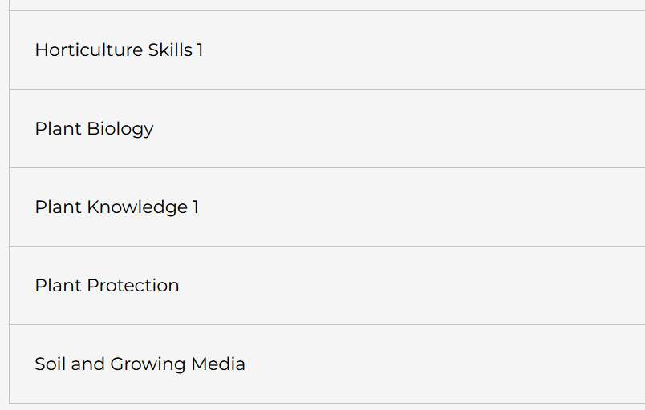
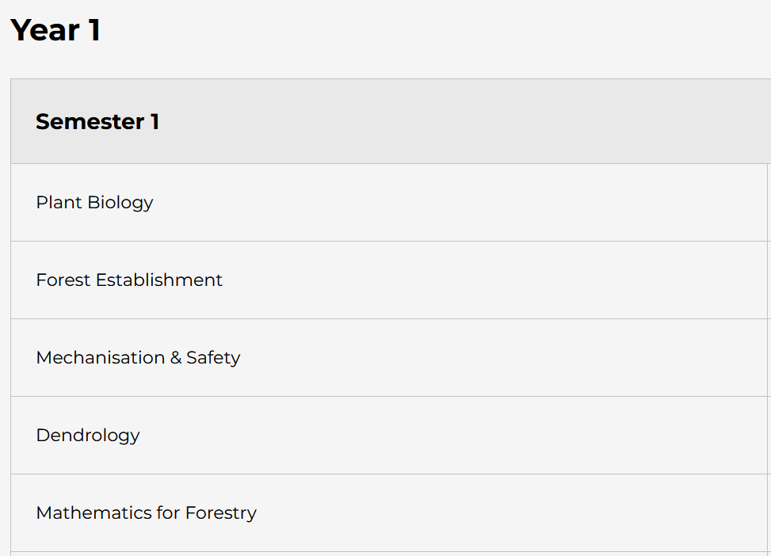
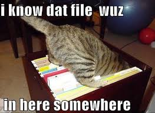

# EXER OneDrive Folders


+ You all have FREE access to [1TB cloud storage through OneDrive](https://www.setu.ie/current-students/study-supports/study-support-waterford/microsoft-office-for-staff-students). 


## Why store my files on OneDrive?

You can access files from anywhere once you have internet access, for example:

- from home, 
- from your phone,
- from any SETU campus, including Kildalton

**EXERCISE to Complete in Class**

- Log onto [OneDrive](https://onedrive.live.com/about/en-ie/) now

- Create one new folder called **ComputingClass**

- Now, create **five more folders**: 

        - one folder for each of your modules listed below:

### BSc in Horticulture modules list



### BSc in Forestry modules list



By the end, you will have created a total of **SIX folders on OneDrive**



```
USE THEM to store files for each your modules 
```

