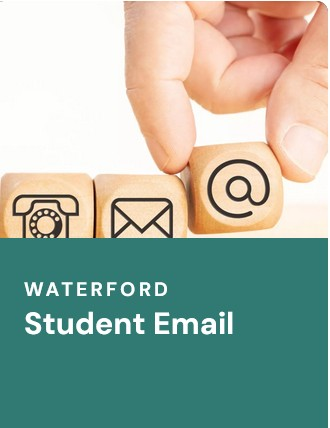
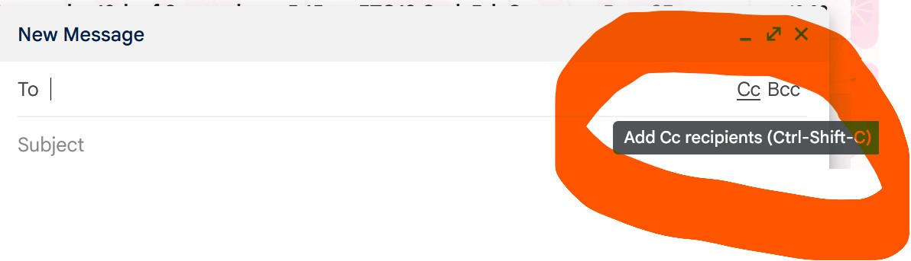
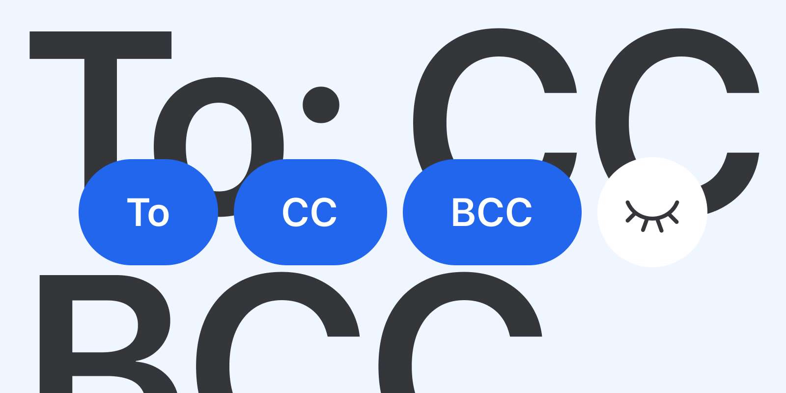
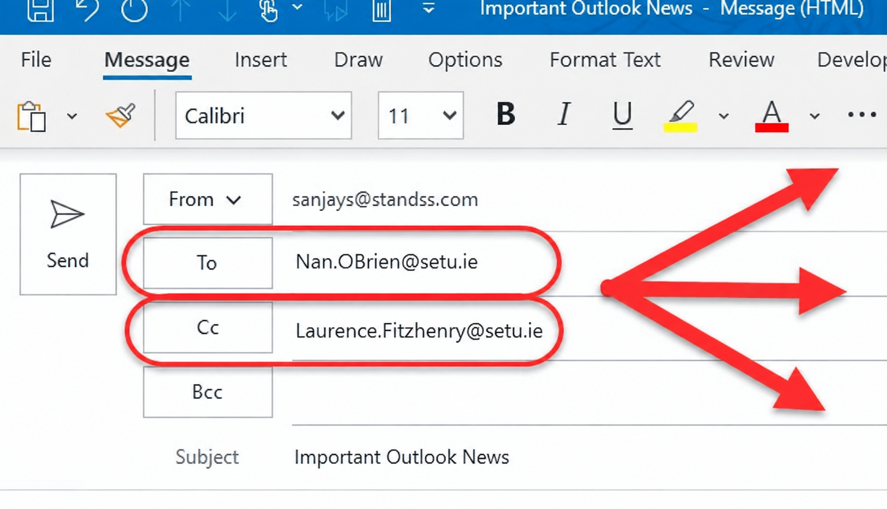
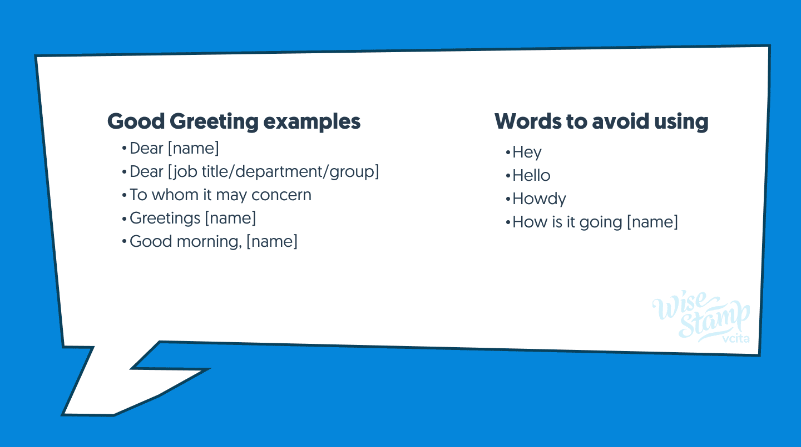
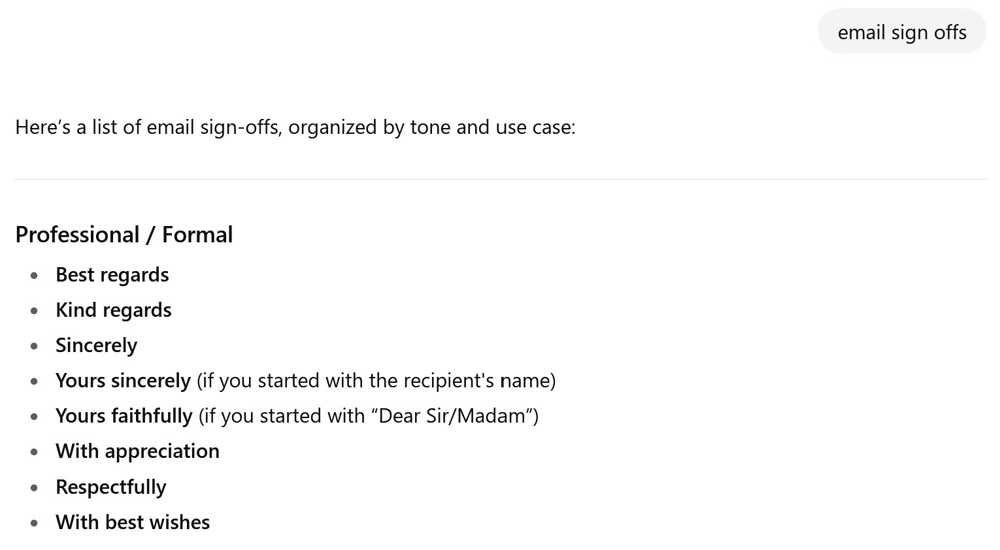

# EXERCISE Emails

Emails · Exercise



**EXERCISE: Write an email to Caroline Cahill**

Open your [SETU student email account](https://www.setu.ie/current-students/student-hub) where you'll be able to access [MS Outlook](https://outlook.office365.com/mail/) now 

Complete the following

1. Compose a new email **To:** [caroline.cahill@setu.ie](mailto:caroline.cahill@setu.ie)


<hr>

**QUESTION**



When should you add content to:
1. the **CC:** field?
2. the **BCC:** field?

Who received this email:



Why is one address in **"To"** and the other in **"CC"**??

<hr>

2. Add the Subject Line: **My Understanding of Class 1**

3. Into your **Email Message** section, add your greeting eg: **"Hi Caroline,"** 

 

ALWAYS politely start every email with a SIMPLE greeting e.g. "Hi Caroline..."

- sounds like common sense eh!!??

 

- Next, for this email, add in a brief description of your understanding of the purpose of:

    - the CC field and
    - the BCC field

<hr>

4. Open a new browser window and open an AI of your choice, such as (but not necessarily) ChatGPT 

- Ask ChatGPT for statistics that relate to the area you're from, for example:
    - some **Forestry** statistics that relate to *your chosen area* or 
    - some **Horticulture** statistics that relate to *your chosen area*


<hr> 

5. Return to your email 

6. Copy and paste your statistic of choice into the **Message** section of the email (paste this below your description of *CC* and *BCC*)

7. To the very end of all emails, don't forget to **sign off** 

```
ALWAYS POLITELY SIGN OFF EMAILS
```



As SETU students, you should include your name and programme 

```
Kind Regards, 
Caroline Cahill
BSc in XXX
```

8. Before hitting **Send**, copy this email to your student email account (*which field will you use: *CC* or *BCC*??).

Now, check your student emails for receipt of this email!


