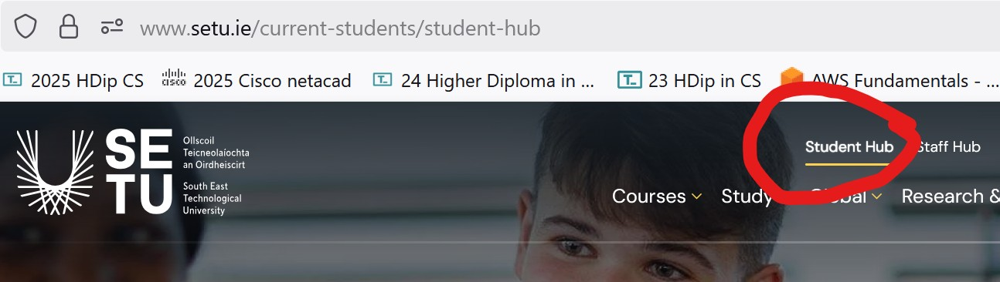
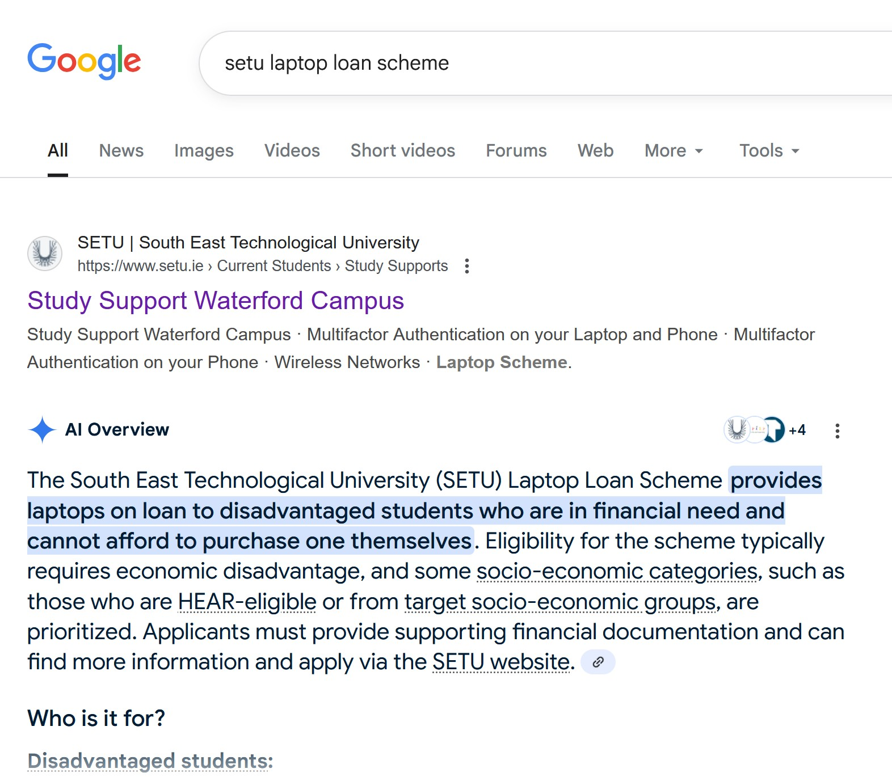

# Supports

Other Supports

There are MANY supports available to you throughout your time with us here in SETU, Waterford

In your own time, browse the [SETU Student Hub](https://www.setu.ie/current-students/student-hub) area.

Some supports include:

- your [academic timetable](https://www.setu.ie/current-students/academic-calendar) for this academic year
- the [Maths Learning Centre](https://www.setu.ie/current-students/student-support-services/computing-and-maths-learning-centre) which offers FREE support throughout the year
- SETU [Disability Supports](https://www.setu.ie/current-students/student-support-services/disability-support-services) which can include but are not limited to, assistive technology, learning support and examination accommodations.
- SETU [Counselling Services](https://www.setu.ie/current-students/student-support-services/counselling-service) including the FREE *Togetherall’s online community*

Students will be also able to apply for the **SETU Laptop Loan Scheme** once available

Please feel free to [email me](mailto:caroline.cahill@setu.ie) if you've **ANY** queries or concerns now or throughout this Semester

Best of luck with the Semester!

Caroline Cahill