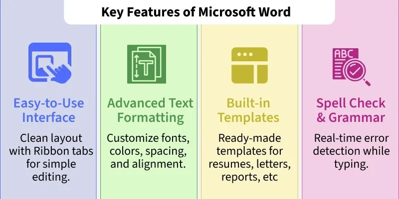
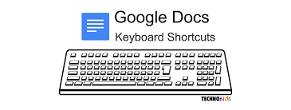

# HOMEWORK

Shortcuts Cheatsheet

By the end of this lab you'll have experience in 

- fundamentals in using MS Word

Feel free to download the editable [MS Word versions of class notes](./archives/archive.zip) for your own editing

Before the next class, you are to:

1. Copy the **Shortcuts** table available [on page 9 of the classnotes](./archives/archive.zip) 
    - select the table by clicking on the **cross** at the top left of the table & pressing **CTRL + C** to copy

2. Paste (**CTRL+V**) this table into a new MS Word document

3. Complete the table:

    - add in each *Keyboard Shortcut Key* in the left column that corresonds to each *Action* in the right column

4. Save your file as **Shortcuts** into your already created **Computing Class** folder on OneDrive

5. Upload your completed work to [WEEK 1 Class 2: keyboard Shortcuts on Moodle](https://moodle.setu.ie/mod/assign/view.php?id=4812493).