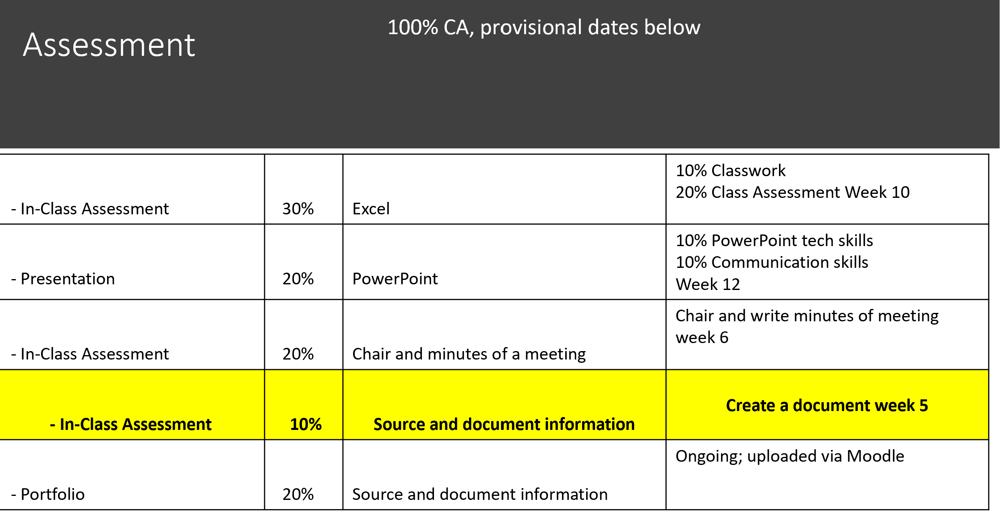

# Objectives

ChatGPT · Buying a computer · 10% Group CA

By the end of this week you'll have experience in 
 
- being able to use an **AI chatbot**, specifically **ChatGPT**
- understand the pro's and con's of such a tool for academic work

**Computer Components**

- understanding the different components in a computer 
- researching new computers
- writing a professionally formatted report to demonstrate your understanding which MUST include Harvard Referencing
- groupwork

10% Group Document due **Monday, 16 October 2023, 5:15 PM**