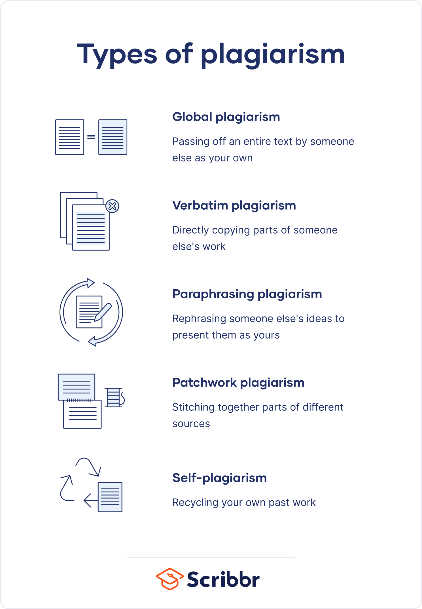

# Fundamental Formatting

File Management · Basic Formatting

## File Management

Create a new MS Word document called **Privacy on the Web** to be saved in your **Computing Class** [OneDrive](https://onedrive.live.com/about/en-us/signin/) folder

Copy and paste in the following “Privacy on the Web” text from this website to the MS Word document called **Privacy on the Web**

Privacy on the web

Once these data are collected they are often merged with other personal data about the individual to develop detailed profiles of customer behaviour for marketing campaigns. Many companies sell personal data in order to obtain income.

The Internet has quickly become one of the most important sources of personal data. If you bank through the net or invest through an on-line brokerage firm, you must give out a great deal more personal data. 

Although you give this information freely, you rarely have any management over what the site will do with it. Additionally many sites are gathering much more personal information without our even being aware of it using “cookies” and other tools for gathering personal data from web visitors. 

Laudon and Laudonette, 2004

# Fundamental MS Word Formatting

1.	Change all of the text to Ariel font, and size 13 [SHORTCUT : Ctrl + ___ to select all]
2.	Change the title “Privacy on the Web” to any one from WordArt
3.	Double underline the Author and date at the end (i.e. Laudon and … 2004)
4.	Move/cut the first paragraph and paste it underneath the last paragraph
5.	Insert the sentence “Obviously, we openly volunteer personal information such as our names, addresses, and e-mail addresses when we register to gain access to a web site, or when we subscribe to an on-line newsletter.” after the first sentence 
6.	Edit “Laudon and Laudonette, 2004” to read “Laudon and Laudon, 2022”
7.	Justify align the document text
8.	Insert a header with your name on the left 
9.	Insert a footer with the page numbers in the right
10.	Use spell check and make changes where necessary. (Proper names are not  included in this spell checking)
11.	Search for the word “important” [SHORTCUT : Ctrl + ___ to search]
12.	Use the **Thesaurus** to change the word “important” to another of the same meaning in the sentence “The Internet has quickly become one of the most important sources of personal data” [_________ to open Thesaurus]
13.	Quick save the document [SHORTCUT : Ctrl + ___ to quick save]
14.	Replace “or invest through an on-line brokerage firm” with “or pay for goods online”.
15.	Find the word “management” and replace it with any one from the Thesaurus
16.	Enter your email address, e.g. 20000000@mail.wit.ie, to the left of the footer (press spacebar to format as a *hyperlink*)
17.	Reformat the document to Times New Roman, size 12 with the text Justified

Next, we will add some **images**

You will need to include Harvard Referencing, - ensuring you credit the original owners of images used prevents plagiarism (as you are not claiming to be the owner of content that you've not created!)

