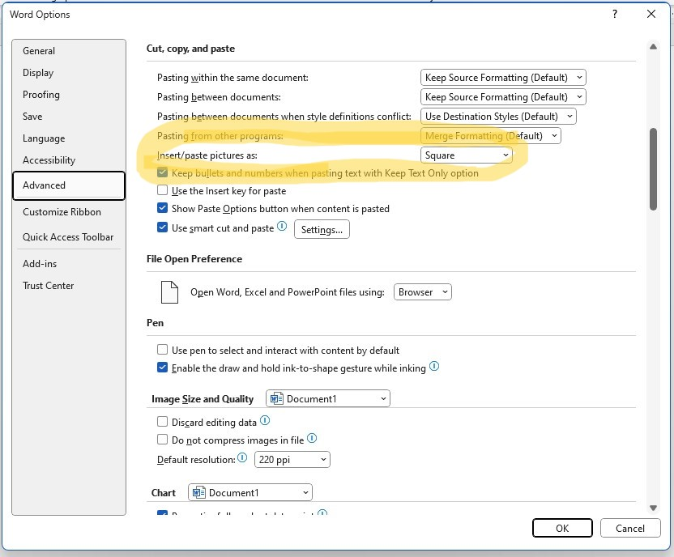

# Screenshots

Images · Snipping Tool · Text Wrap to Reposition

## Using screenshot

+ Open your **Privacy on the Web** document from the previous lab (that we completed in class)
+ You wish to add in a screenshot of the current date and time
+ Open the **Snipping Tool** or **Snip and Sketch**:

        + Click the `Windows` button
        + Start typing `Snip`
        + Open the `Snip and Sketch` (or alternatively `Snipping Tool`)

+ Click **New**
+ Use your mouse to take a screenshot of your time and date at the bottom right of your screen
+ Return to your **Privacy on the Web** MS Word document
+ Press CTRL+V to paste the screenshot into **Privacy on the Web** document.

## Reposition an image

Move your image to the left of the second paragraph

**Can't move the image??**:

By default an image and text are not allowed on the same line.

+ You'll need to format an images Layout options to turn on **text wrapping** 

## Change image default setting 

If you wish to be able to move images by default you can override this setting via:

- File/Options (the very last option down low)
- Advanced
- Go to *Cut, Copy, and paste* section
- Change *Insert/paste pictures as:" to "Square"

## Resize an image 

+ Resize your image using the handles on the corners 

+ Drag your re-sized image to its new position to the left of the second paragraph
