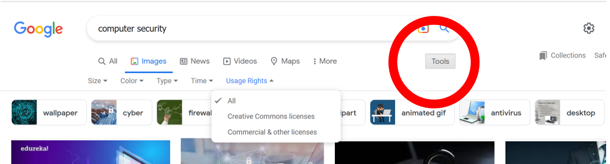
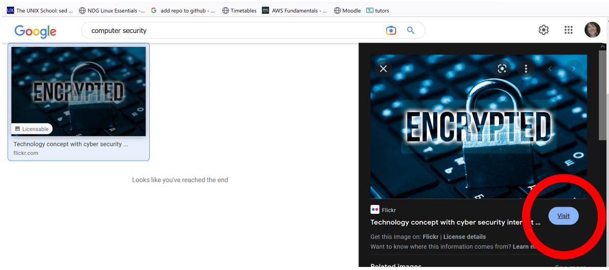

# Image Copyright

Format · Copyright

**DOWNLOADING IMAGES FROM THE WEB**

A Creative Commons license is one of several public **copyright licenses** that enable the free distribution of an otherwise copyrighted material. 

**SEARCHING GOOGLE FOR CREATIVE COMMONS IMAGES**

- Go to [Google images](https://images.google.com/) search bar, to only return images.
- Enter the search term **computer security**.
- Hit **Enter** 
- Click on **Tools** and **Usage Rights**:

- Select the type of licence you wish to search for, in this case **Creative Commons licenses**

- Choose an image to see more detail and then click on **Visit** (to get more detail of origin, ownership etc.):

**INSERTING AN IMAGE**

+ Take a screenshot of the (part of the) image you wish to use in your own document.

**REPOSITION AND RESIZE IMAGES**

You wish to move your image beside the first paragraph

TIP: format an images Layout options to turn on **text wrapping** 

+ Resize your image using the handles on the corners 
+ Drag your re-sized image to the right of the first paragraph

**HARVARD REFERENCING IMAGES**

But YOU don't own this image... so you need to give **credit to the owner** of the work & not cause yourself any **plagiarism** issues

All Creative Commons licences require that you credit the owner of the content that you use.  

We will make use of the **Harvard System of Referencing**

