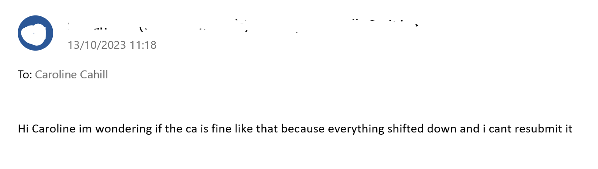
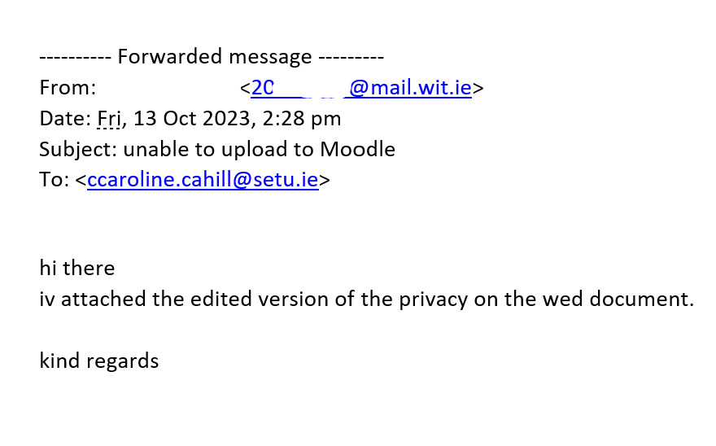
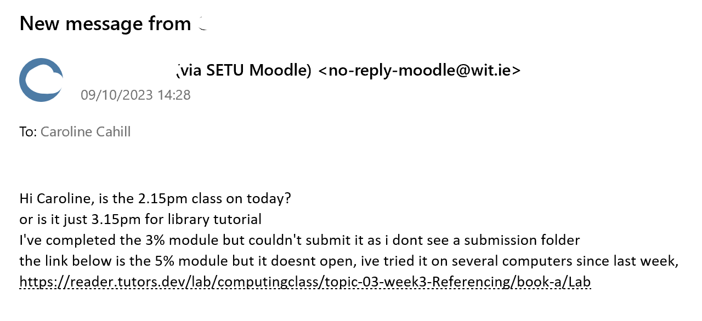
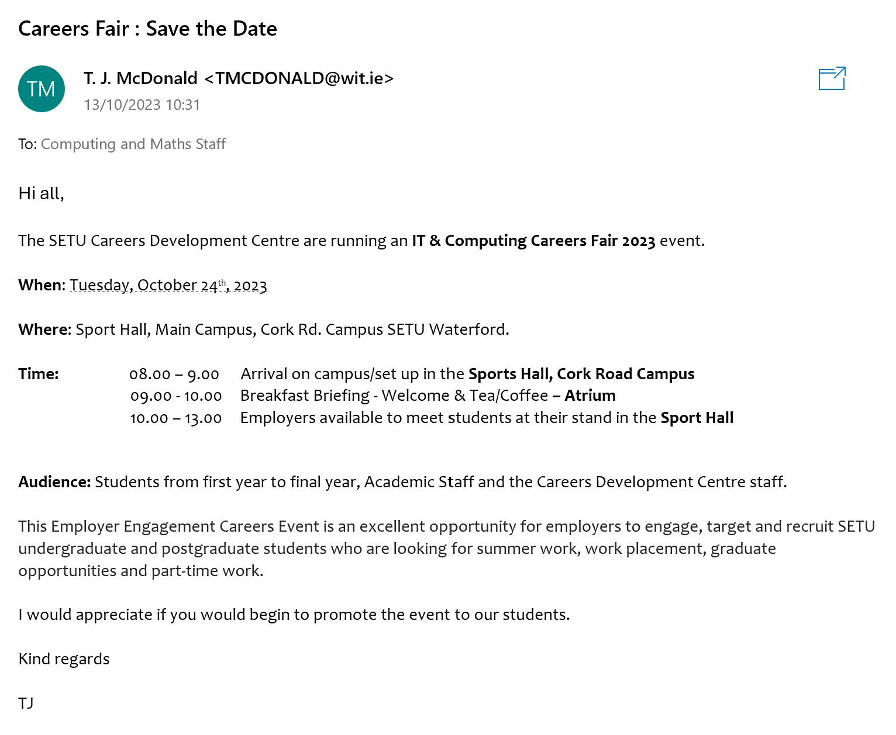
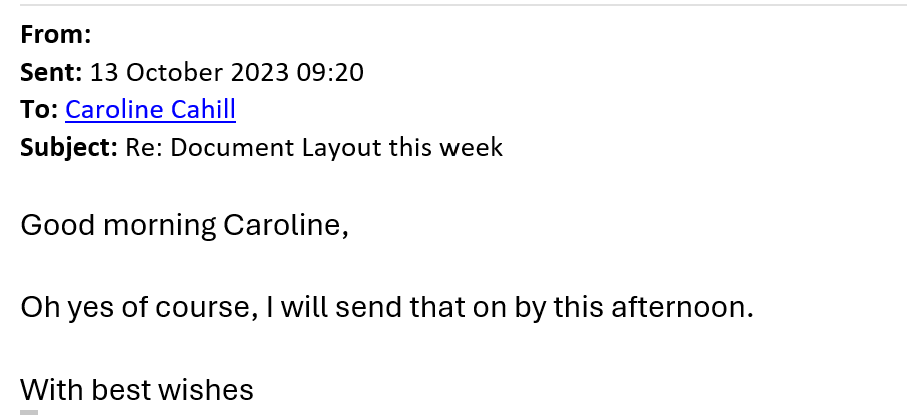

# Summary  

Worksheet · Compare & Contrast

# Emails: The Good, The Bad & The Ugly!

Compare the email images below to the email in the class notes where it demonstrates the components that should be present: 

- the subject line,
- addressing the recipient,
- letting the recipient know why you're writing,
- letting the recipient know what is your "call to action" i.e. what do you want to be the outcome of the email?, 
- conclude with a sign off AND your name.

Compared to these which are **well formatted**:

Don't overthink it - short emails can be well formatted too: 

