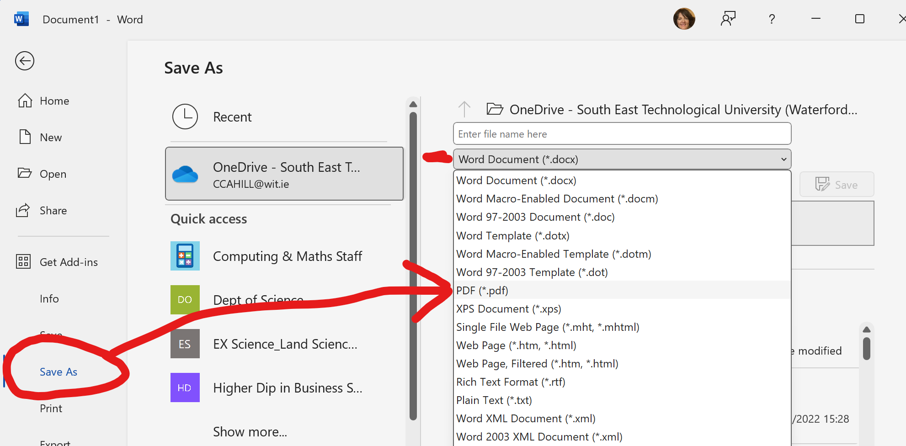

# 2% Homework

Email Exercise

For this class, you are to 

- *download* the MS Word [Effective Emails document](./archives/archive.zip) 

- *fill in the blanks* to complete the above document

- For 2% of your CA, email me, [Caroline Cahill](mailto:caroline.cahill@setu.ie) with your completed document as a .pdf

**TIP: SAVE YOUR MS WORD AS A .PDF**

- In MS Word, go to **File/Save As...** 
- Change *Save as type* to **.pdf**

When creating an email, you should always remember:

## Solid Opening Line

Have you 
- included the **Subject:** line?
- introduced yourself in context

"I am in your year 1 BSc in X class.. "

## Clear message 

- What is the purpose? 
- Is it clear AND concise?

"I am in your year 1 BSc in X class and I’m reaching out about the possibility of getting additional help with our Harvard Referencing"

## Clear call to action

- What action do you want **to happen** because of this email?

"I am in your year 1 BSc in X class and I’m reaching out about the possibility of getting additional help with our Harvard Referencing. The class were wondering if you would please post one more video describing how to complete the handout given in class last week"

## END

Did you sign off professionally: 

Yours Sincerely,
[[your full name]]

Best regards,
[[your full name]]

**TIPS** 

Take note of your

- introduction (who are you & why are you writing)
- punctuation
- grammar
- attachments, where relevant
