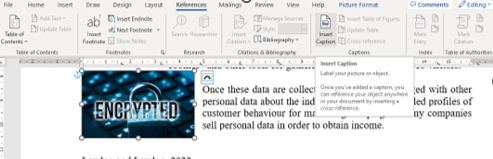
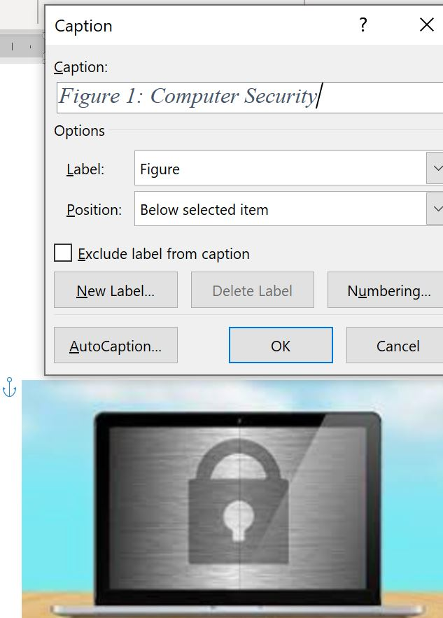

# Referencing Material

How to Reference

Reopen your **Privacy on the Web** document 

You need to:
- add a **Caption** to the newly pasted image so that you can then create a **Table of Figures** in your document AND also
- acknowledge the source of the image you've entered in this document

**IMAGE CAPTIONS**

In MS Word, select the image, and under the **References** ribbon, choose to **Insert Caption**

Give it an appropriate title of your choice, such as **Computer Secutity** and click **OK**

**HARVARD REFERENCE IMAGES**

To give credit to the owner of this image you must reference it

+ With your cursor *within* the **image Caption**, click **Insert Citation** from the **References** tab

You've never used this source (this website) before so choose **Add New Source**

+ Now, fill in the blanks with detais from the original website and click **OK**

**HARVARD REFERENCE BOOKS**

(1) Copy and paste the following:

**According to a study conducted by the Center for the Built Environment at the University of California, Berkeley, 25,000 occupants of 150 buildings were surveyed to question users' satisfaction regarding air quality, comfort, acoustics, and lighting**

which is content taken from the book:

(2) You’ve used ideas and added your paraphrased sentence "**These findings were agreed upon by respected professionals in the field**", taken from the following book : 

+ Create the Citation and associated Harvard Reference to this statement

(3) You've added **Others disagreed with this statement following a survey of 350 people late last year** taken from a book titled **“The Complete Guide to Referencing and Avoiding Plagiarism”**

+ Create the Citation and associated Harvard Reference to this statement

**HARVARD REFERENCE WEBSITES**

Google Search for **News** articles relating to **Biodiversity** from only Irish domains

+ Choose one **News** article of interest to you and add some content into your **Privacy on the Web** document

+ Create the Citation and associated Harvard Reference to this content.

**HARVARD REFERENCE JOURNAL ARTICLES**

Make use of [SETU's online library](https://library.setu.ie/) facility and search for ANY journal article(s) relating to: 

1. sustainability 
2. organic farming 

+ Create the Citation and associated Harvard Reference to your new content.
 
**5% SUBMIT YOUR COMPLETED WORK**

+ Add your name into the document **header**
+ Add your course into the document **footer** along with the page numbers
+ Upload your completed file to the [5% Privacy on the Web Completed Document](https://moodle.wit.ie/mod/assign/view.php?id=4334417) Area in Moodle

*GENERAL TIPS WHEN RESEARCHING:*
+ Make use of the News tab in Google

+ Filter google search results to make results more accurate and relevant to you such as adding site:.ie
