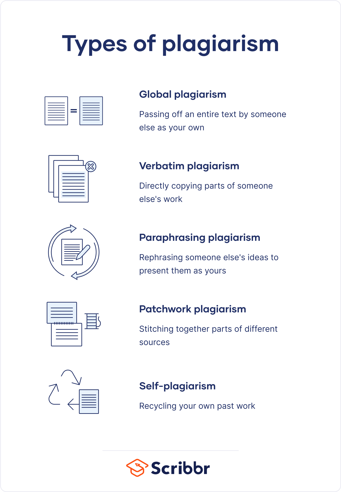

# Harvard Referencing

Harvard Ref · 5% CA 

+ Complete todays labs in class

+ Upload your completed classwork file to the [5% Privacy on the Web (Referenced) Document](https://moodle.wit.ie/mod/assign/view.php?id=4334417) Area in Moodle



*GENERAL TIPS WHEN RESEARCHING:*
+ Make use of the News tab in Google

+ Filter google search results to make results more accurate and relevant to you such as adding the phrase 

```bash
SearchPhrase site:.ie #if you only want results from *.ie* websites

SearchPhrase site:independent.ie #if you only want results from *independent.ie* website
```

