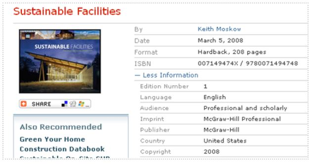

# Referencing Material

How to Reference

**1. HARVARD REFERENCE IMAGES**

To give credit to the owner of this image you must reference it

+ With your cursor *within* the **image Caption**, click **Insert Citation** from the **References** tab

You've never used this source (this website) before so choose **Add New Source**

+ Now, fill in the blanks with detais from the original website and click **OK**

**2. HARVARD REFERENCE BOOKS**

(1) Copy and paste the following:

**According to a study conducted by the Center for the Built Environment at the University of California, Berkeley, 25,000 occupants of 150 buildings were surveyed to question users' satisfaction regarding air quality, comfort, acoustics, and lighting**

which is content taken from the book:

(2) You’ve used ideas and added your paraphrased sentence "**These findings were agreed upon by respected professionals in the field**", taken from the following book : 

+ Create the Citation and associated Harvard Reference to this statement

(3) You've added **Others disagreed with this statement following a survey of 350 people a number of years ago** taken from a book titled **“The Complete Guide to Referencing and Avoiding Plagiarism”**

+ Create the Citation and associated Harvard Reference to this statement

**3. HARVARD REFERENCE WEBSITES**

Google Search for **News** articles relating to **Biodiversity** from only Irish domains

+ Choose one **News** article of interest to you and add some content into your **Privacy on the Web** document

+ Create the Citation and associated Harvard Reference to this content.

**4. HARVARD REFERENCE JOURNAL ARTICLES**

Make use of [SETU's online library](https://library.setu.ie/) facility and search for ANY journal article(s) relating to: 

1. sustainability 
2. organic farming 

+ Create the Citation and associated Harvard Reference to your new content.

**5% SUBMIT YOUR COMPLETED WORK**

+ You should add a **Cover Page** with suitable content
+ You should add an automated **Table of Contents**(RECALL: Make use of Heading 1 styled text - this is all that's needed to generate an auto TOC)
+ You should have an automated **Table of Figures**(RECALL: Make use of Captions to label objects - this is all that's needed to generate an auto TOF)
+ Your name should be in the document **header**
+ Your course should be in the document **footer** along with the page numbers
+ Upload your completed file to the [5% Privacy on the Web (Referenced) Document](https://moodle.wit.ie/mod/assign/view.php?id=4334417) Area in Moodle

