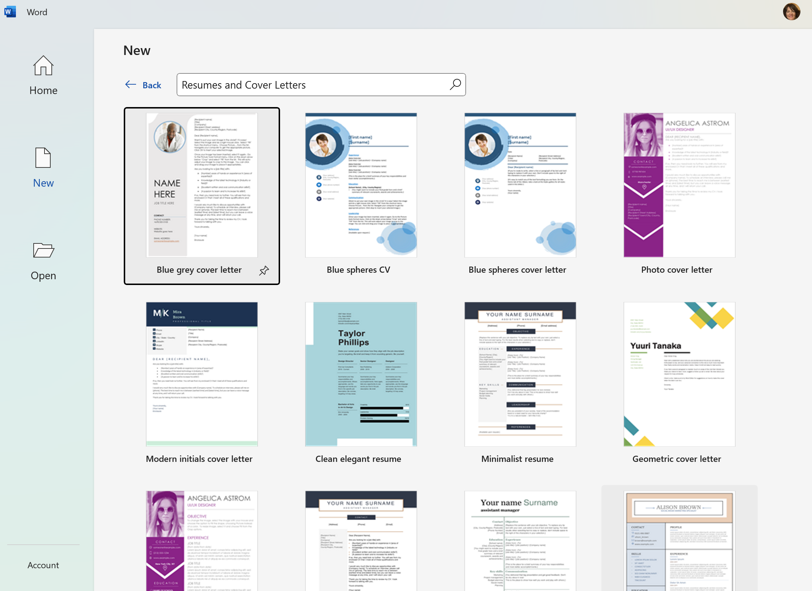

# Master CV Template & CA Details

10% Placement CV 

Using details gathered in your bulky Master CV template, you are to now:

- search online for a realistic Semester 4 Placement placement opportunity
- choose **one specific company & position** you would potentially like to apply to
- in MS Word, choose any one of the **Resume** templates 
- save to your OneDrive
- modify this template to showcase your BSc skills that this employer would be most interested in

# SUMMARY:

TWO UPLOADED FILES: 
 1. Give the name of the comany and the position that you would like to apply to for your BSc Placement

2. Choosing the most relevant content from your Master CV template created in class, create a one-page CV, secifically written for the above company.

Focus on your skills that this employer would be **most interested in hearing about** (in particular your BSc skills)

3. Upload to [10% 1-page CV Ready for Placement](https://moodle.wit.ie/mod/assign/view.php?id=4360218) on Moodle.

DUE: 9pm Friday Oct 11th