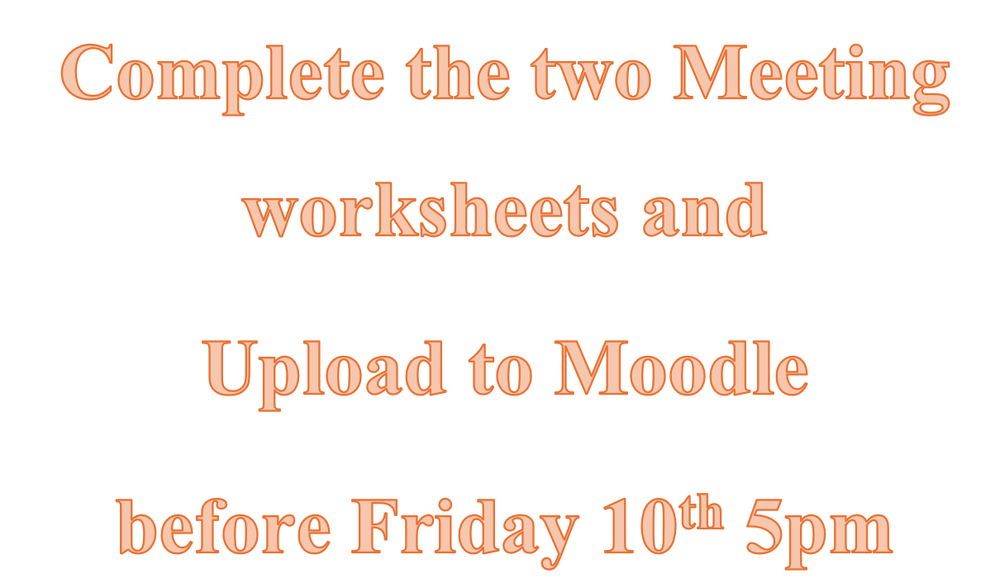

# Objectives

Minutes · Emails · 20% CA

By the end of this week you'll have experience in:

- Writing a realistic agenda

- Creating accurate meeting minutes

- Practising communication and planning skills

- Reflecting on how meetings are led in the workplace

Please download and complete the two [Meeting files](./archives/archive.zip) for completion for this Week 5 

- **1. Meeting Chairperson Role** worksheet
- **2. Meeting_Roles_and_Reflection** worksheet

and 

- [Upload to Moodle](https://moodle.setu.ie/mod/assign/view.php?id=4604528) before the end of this week.

**20% Individual CA Task:**

As an individual student, you will choose a horticulture or forestry-related scenario and:

1. Watch or read a relevant online discussion (e.g., webinar, podcast, panel talk), see more details in the **Resources** lab page

2. Write a professional **agenda** as if you were chairing a team meeting

3. Write **meeting minutes** as if that content was your team's discussion

4. Reflect on how you would **chair this meeting** in real life

**Grading Rubric of 20% Individual CA Submission:**

20% Realistic & clear agenda 
- Submission via email

30% Accuracy and structure of minutes
- Submission via email

20% Insightful reflection
- Submission via Moodle upload

15% Use of appropriate & Harvard Referenced external resource(s)

15% Professional formatting throughout

Deadline: **Friday, 17 October 2025, 5:15PM**

For the purpose of this piece of CA you can make the assumptions that:
- these meetings are always held on the last Friday of the month
- the venue is the SETU boardroom 