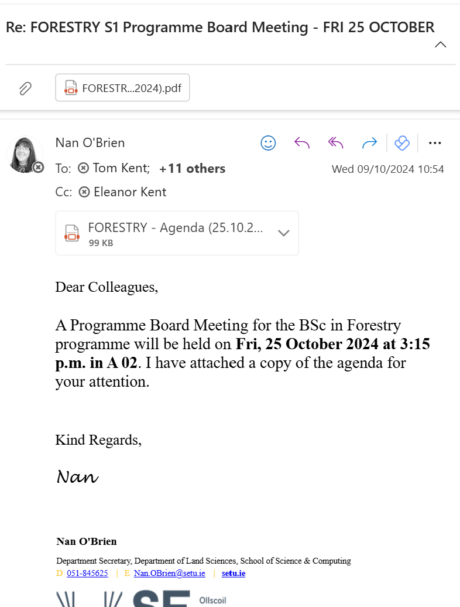
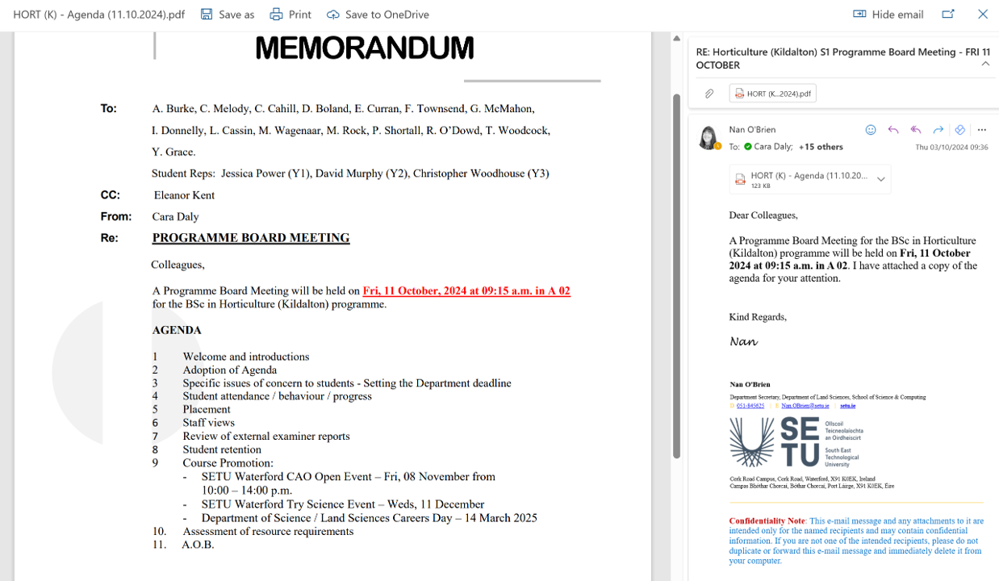

# 1. Agenda

Meeting Agenda

Firstly, you must choose a topic

Pick **one forestry** or **one horticulture** topic of interest to you

- feel free to refer to the **Meeting Resources** lab page

2. Write a Professional Agenda

Include:

- Date, time, location (or online)

- Chairperson (you)

- List of attendees (you can make these up)

- Minimum of 5 items (e.g., “Discuss soil testing results”, “Agree planting schedule”)

- Timing for each item

 

Sample Agenda template for a meeting

 

- This template has a [YouTube tutorial video](https://www.youtube.com/watch?v=oa89MgruZ30) showing how to create using MS Word.

**SUBMISSION of Agenda via email only**

Using professional email formatting, you are to [email Caroline Cahill](mailto:caroline.cahill@setu.ie) in a professional and efficient manner with your **Meeting Agenda** attached:

- attach the meeting agenda in *.pdf format*
- Use the subject line: "Meeting Agenda"
- CC yourself, using your SETU student email address

SAMPLE agenda email:

SAMPLE 2: agenda email:

**RECALL: SAVING AS A .PDF**

- In MS Word, go to **File/Save As...** 
- Change *Save as type* to **.pdf**

