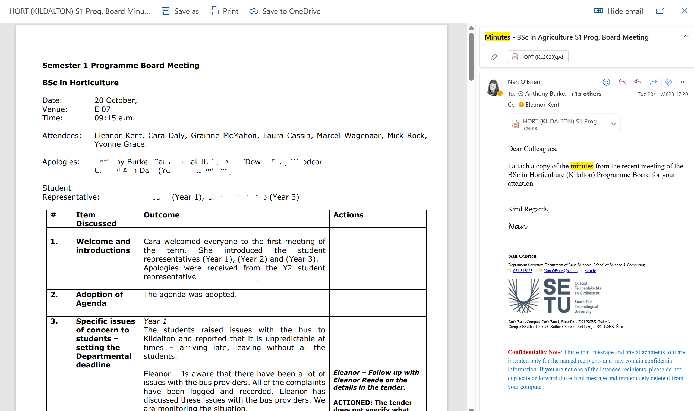

# 2. Minutes

Write Meeting Minutes

Following from your Agenda and "attendance" at your meeting, using MS Word, write your meeting minutes as if your team had just discussed those points. 

Include:

- Who was present (real or invented)
- What was discussed
- Key decisions made
- Action items

and any other content you feel is relevant to capture the essence of the meeting as per your class notes.

**SUBMISSION via email only**

- Again, [email Caroline](mailto:caroline.cahill@setu.ie) attaching your **minutes.pdf** file.
- Use the subject line: "**Meeting Minutes**"
- CC yourself, using your SETU student email address 

**SAMPLE: Minutes of a meeting**:

