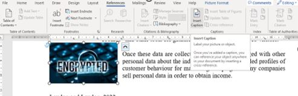
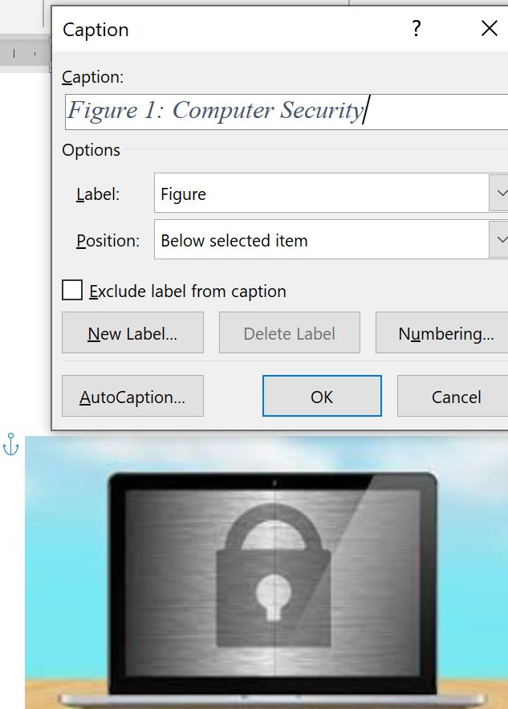

# Image Captions

Add a Caption image label

Reopen your document 

You need to:
- add a **Caption** to the newly pasted image so that you can then create a **Table of Figures** in your document AND also
- acknowledge the source of the image you've entered in this document

**IMAGE CAPTIONS**

In MS Word, select the image, and under the **References** ribbon, choose to **Insert Caption**

Give it an appropriate title of your choice, such as **Computer Secutity** and click **OK**

