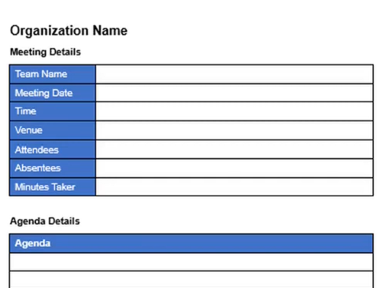

# 1. Agenda

Agenda

For whichever simulated meeting you've chosen, complete the following documentation:

**PART 1 - 7% Write agenda and email to Caroline**

Write up the Agenda for your chosen meeting

 

This template has a full tutorial video [available on YouTube](https://www.youtube.com/watch?v=oa89MgruZ30) showing how to create using MS Word.

- Following completion of last weeks professional email formatting class, you are to [email Caroline](mailto:caroline.cahill@setu.ie) in a professional and efficient manner with a **Meeting Agenda**

- attaching the meeting agenda in *.pdf format*
- Use the subject line: "Meeting Agenda"
- CC yourself, using your personal *or* your student email address

SAMPLE 1: agenda email:

SAMPLE 2: agenda email:

**TIP: HOW TO SAVE YOUR MS WORD DOCUMENT AS A .PDF**

- In MS Word, go to **File/Save As...** 
- Change *Save as type* to **.pdf**

