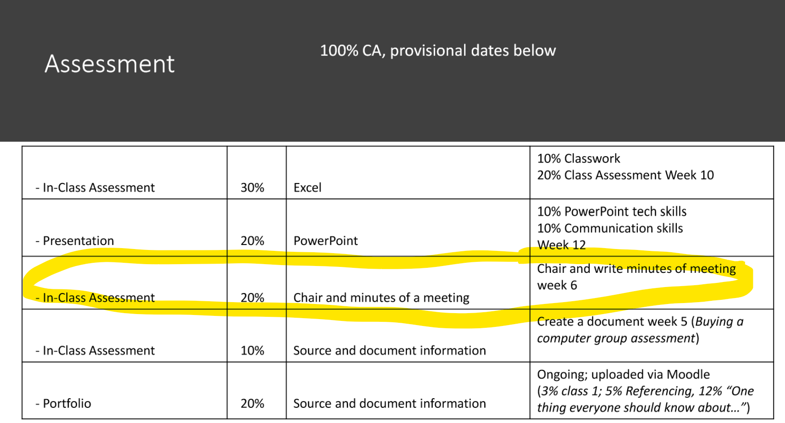

# Objectives

Minutes · Emails · 20% CA

By the end of this week you'll have experience in 

**MINUTES OF A MEETING**

20% Individual Submission (which will be two emails plus one document/image) 

- Deadline: **Monday, 30 October 2023, 5:15 PM**

You will:

**BEGIN** Prepare for a meeting by writing an agenda and emailing as a .pdf document

**MIDDLE** Take live, pen and paper, draft minutes while attending a virtual meeting, uploading a photo of these to Moodle and 

**END** Reformatting these draft minutes into a professionally formatted, sharable .pdf document to be emailed as a .pdf document