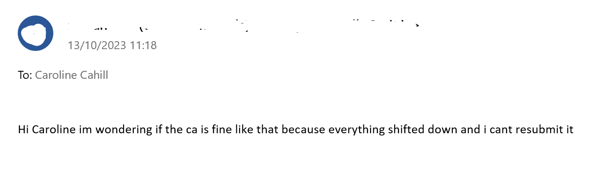
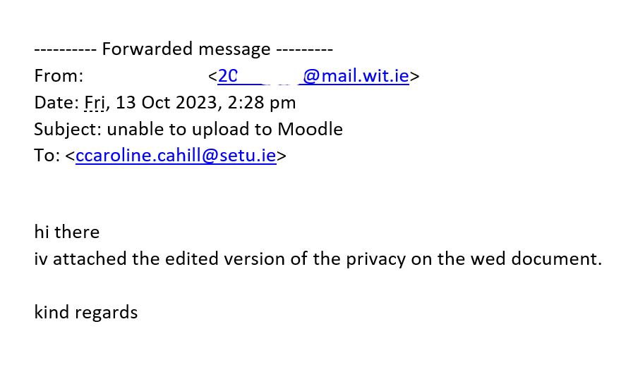
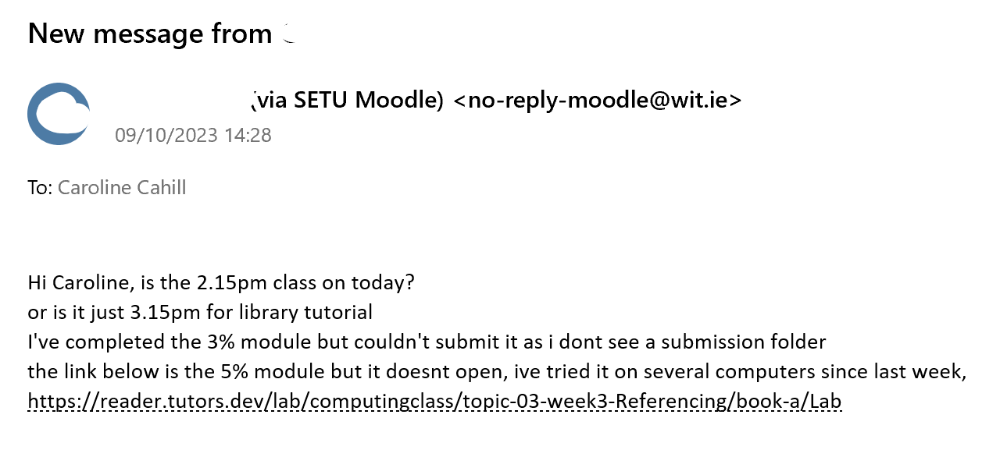
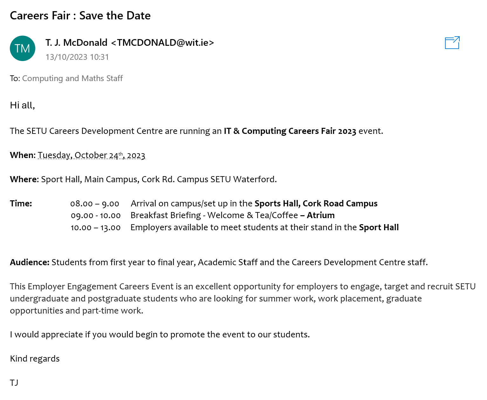
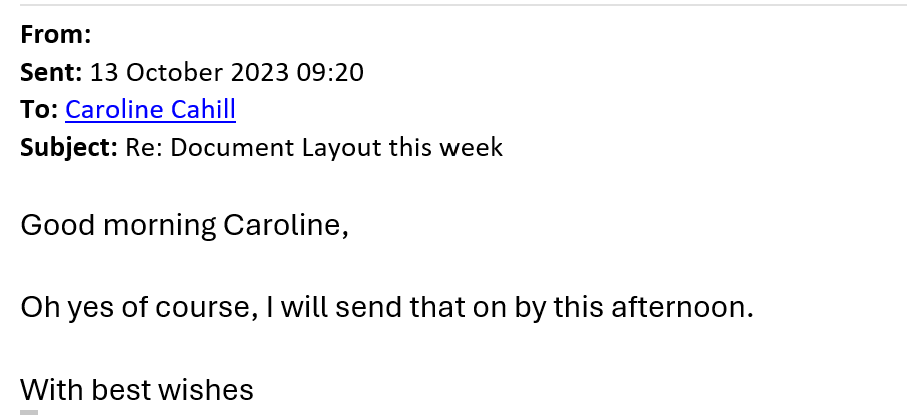

# Writing Emails

Effective Email Writing · Dos and Donts

For this class, you are to 

- *download* the MS Word [Effective Emails document](./archives/archive.zip) 
- follow along with the class/lecturer
- *fill in the blanks* to complete the above document

All of these tips are to be used when emailing me, [Caroline Cahill](mailto:caroline.cahill@setu.ie) with your **two .pdf documents**, namely the:

1. Meeting Agenda and
2. Meeting Minutes 

- Why would these be considered **poorly formatted emails**?

Compare them to the email in the class notes where it demonstrates the components that should be present: 
- the subject line,
- addressing the recipient,
- letting the recipient know why you're writing,
- letting the recipient know what is your "call to action" i.e. what do you want to be the outcome of the email?, 
- conclude with a sign off AND your name.

Compared to these which are **well formatted**:

Don't overthink it - short emails can be well formatted too: 

