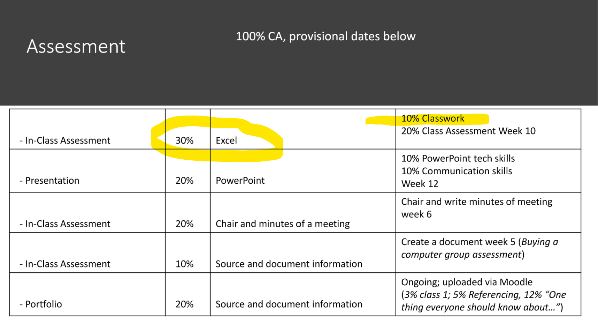

# Objectives

Fundamentals · 5% Classwork CA

For this class please download the folder containing [MS Word format of the class notes &  the MS Excel Arithmetic file](./archives/archive.zip)

By the end of this week you'll have experience in using Microsoft Excel to 

- amend and work around a functional spreadsheet
- be able to complete fundamental **formatting**
- be able to complete fundamental **arithmetic** - add, subtract, multiply, divide as well as compare cells
- use **Conditional Formatting**