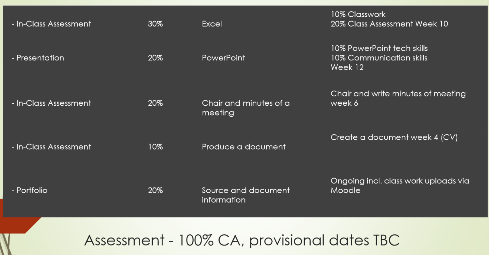

# Objectives

Fundamentals · 5% Classwork CA

For this class please download the folder containing [MS Word Class1_Intro_Notes.docx notes & the MS Excel Arithmetic file](./archives/archive.zip)

- You will [upload the completed Arithmetic file to Moodle](https://moodle.wit.ie/mod/assign/view.php?id=4334420) before 9pm Friday 1st Nov 

By the end of this week you'll have experience in using Microsoft Excel to 

- amend and work around a functional spreadsheet
- be able to complete fundamental **formatting**
- be able to complete fundamental **arithmetic** - add, subtract, multiply, divide as well as compare cells
- use **Conditional Formatting**

This is another important section and you will all be using MS Excel again, including:

- BSc in Forestry with Tom in Semester 2 for Earth Science and
- BSc in Horticulture with Marcel in year 3 for Financial Analysis for your Business and Cara's Project module