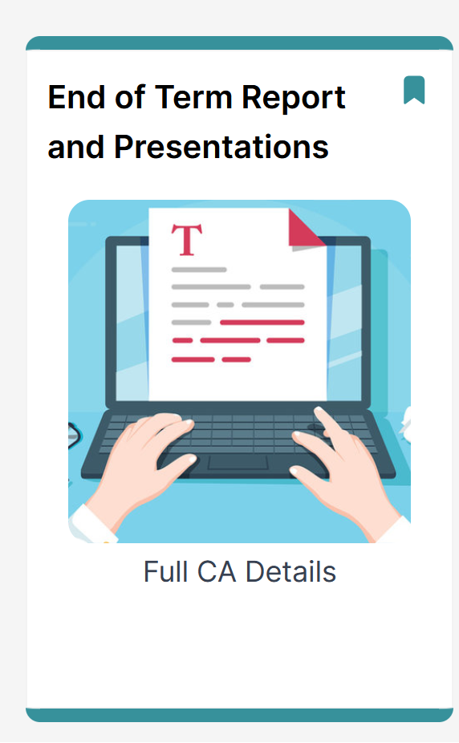

# Full CA Details

Details · Timetable · Grading

Your presentions will go ahead at the start of week 12

- You must carefully choose only a number of the main findings from your research and present these
- do not summarise the whole research report!!!

MS PowerPoint is an AID to your presentation
- minimise the amount of text
- maximise the visuals (images/graphs etc.) to make it more interesting!

PLEASE REFER BACK TO THE FULL [PRESENTATION CA DETAILS](https://tutors.dev/topic/computingclass/topic-000-week000-Research):

This includes details of:
1. MS PowerPoint features expected such as:

    - a consistent design template, 
    - slide transitions (how one slide moves to the next)
    - animations (how objects appear and leave the slide)
    - timings for animations

2. Grading Rubric

